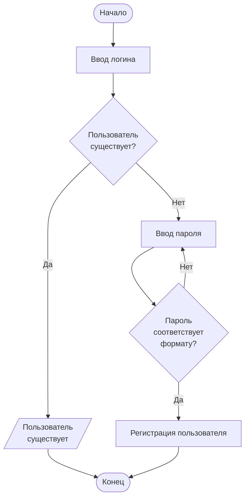

[//]: # (Афанасьев, вариант №1)

# Математическая формула

Квадратичное уравнение:
$ax^2+bx+c$

---

# Диаграмма Mermaid



---

# HTML

<input type="text" placeholder="Введите имя"/>
<button>Ввод</button>

---

# Сложные таблицы

<table>
	<tbody>
		<tr>
			<td colspan="2" align=center>Расписание</td>
		</tr>
		<tr>
			<td>8:30-10:00</td>
			<td></td>
		</tr>
		<tr>
			<td>10:20-11:50</td>
			<td>Технология разработки программного обеспечения ЛК</td>
		</tr>
		<tr>
			<td>12:10-13:40</td>
			<td>Технология разработки программного обеспечения ЛБ</td>
		</tr>
		<tr>
			<td>14:00-15:30</td>
			<td>Технология разработки программного обеспечения ЛБ</td>
		</tr>
		<tr>
			<td>15:30-17:20</td>
			<td>Математическое моделирование ЛБ</td>
		</tr>
		<tr>
			<td>17:40-19:10</td>
			<td></td>
		</tr>
	</tbody>
</table>

---

# Галерея изображений


---

# Вложенные списки

Список покупок
* Продукты
  * Молоко
  * Хлеб
  * Яйца 10 шт
  * Овощи
    * Огурцы
      * Первый сорт 2 шт
      * Второй сорт 3 шт
    * Помидоры 3 шт
* Химия
  * Моющее средство
    * Для посуды
    * Для сантехники
  * Стиральный порошок

---

# Подсветка синтаксиса

*Код на Python*

```py
import subprocess
result = subprocess.check_output(["netsh","wlan","show","network"])
result = result.decode('unicode_escape')
result = result.replace("\r","")
ls = result.split("\n")
ls = ls[4:]
ssids = []
x = 0
while x < len(ls):
    if x % 5 == 0:
        ssids.append(ls[x])
    x += 1
print(ssids)
input()
```

*Код на JS*

```js
let a_x, a_y, b_x, b_y, c_x, c_y;
function countLen(x1, y1, x2, y2){
    a = Math.abs(x1-x2);
    b = Math.abs(y1-y2);
    c = Math.sqrt(a*a+b*b);
    return c;
}
function countPer(a, b, c){
    per = a + b + c;
    return per;
}
function countSqr(a, b, c, per){
    p = per/2;
    S = Math.sqrt(p*(p-a)*(p-b)*(p-c));
    return S;
}
a_x = 1;
a_y = 4;
b_x = 3;
b_y = 2;
c_x = 2;
c_y = 1;

a = countLen(a_x, a_y, b_x, b_y);
b = countLen(b_x, b_y, c_x, c_y);
c = countLen(c_x, c_y, a_x, a_y);

Per = countPer(a, b, c);

Sqr = countSqr(a, b, c, Per);

console.log(Sqr);
```

---

# Цитаты

> «Я никогда не думаю о будущем. Оно настает слишком быстро».

> «Женщины выходят замуж, надеясь, что мужчины поменяются. Мужчины женятся, надеясь, что женщины не изменятся никогда. И те, и другие разочаровываются».

> «Здравый смысл — собрание предубеждений, приобретённых к восемнадцати годам».

> «Если бы я мог прожить жизнь заново, я был бы сантехником».

*__(c) Альберт Эйнштейн__*

# Автоматическая таблица содержания

- [Математическая формула](#математическая-формула)
- [Диаграмма Mermaid](#диаграмма-mermaid)
- [HTML](#html)
- [Сложные таблицы](#сложные-таблицы)
- [Галерея изображений](#галерея-изображений)
- [Вложенные списки](#вложенные-списки)
- [Подсветка синтаксиса](#подсветка-синтаксиса)
- [Цитаты](#цитаты)
- [Автоматическая таблица содержания](#автоматическая-таблица-содержания)
- [Эмодзи успеха и ошибки](#эмодзи-успеха-и-ошибки)

# Эмодзи успеха и ошибки


Успех :x:
Ошибка :heavy_check_mark: